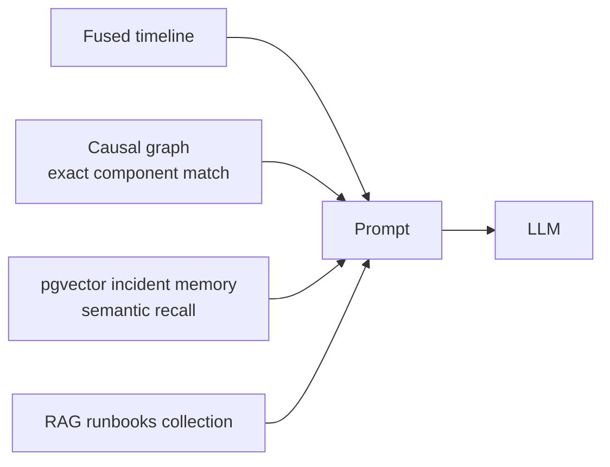

# Analysis Pipeline

> [!info] Runs before the RCA
> [[The Council]] generates a hypothesis set and pools independent voters' beliefs
> ahead of the narrative pass described here. Triage decides whether any of this
> runs at all — see [[Ingest and Triage]].

The core loop: raw logs in, structured RCA + ranked runbook out.

## 1. Ingest — `incidents/evidence.controller.js`

`POST /incidents/:incidentId/files` (multipart). Per file:

1. Verify the incident belongs to `req.user.organizationId`, else 404.
2. **Reduce** the stream (`streamReduce.js`).
3. **Redact** if `REDACTION_KEY` is set — one redactor per request, seeded from this incident's existing map so placeholders stay stable across files *and* re-uploads.
4. **Encrypt at rest** with `encryptField(tenantId, …)`.
5. Insert `evidence` row, create a pending `report`, enqueue on `analysis-queue`.

### streamReduce — the bounded slice

Never buffers a whole upload; never stores a multi-GB log inline. Streams, gunzips if needed, and retains **4 MB** at constant memory, split two ways:

| Bucket | Budget | Rationale |
|---|---|---|
| Earliest lines | 40% (1.6 MB) | Incidents cascade from their origin |
| Highest-severity lines | 60% (2.4 MB) | ERROR/FATAL/stack traces, from *anywhere* in the file |

> [!tip] Why two buckets
> A pure head-first truncation misses the smoking gun buried at line 4,000,000. Severity-ranked retention catches it wherever it sits.

Also guards: 200k retained lines per bucket, 1 MB hard-split on any single line (minified JSON, undetected binary), and an 8 KB binary sniff (NUL bytes + control-char ratio).

## 2. Fuse — `logFusion.js`

Every line from every source → one chronological stream.

- Timestamp extracted per line (ISO first, then other formats).
- Formats extracted but unparseable by `Date` (Apache's `12/Jul/2026:10:00:00`) yield `NaN` → sorted to `Infinity`, because `NaN` comparators make sort nondeterministic.
- Dedupe on lowercased, whitespace-stripped text.
- Output lines: `[source] timestamp | raw`.

## 3. Assemble context — `analysis.service.js`

Three memory sources merged into the prompt, **all best-effort** — a failure in any one must not block the analysis:

| Source | Match type | Module |
|---|---|---|
| Causal graph | Exact `component_name` equality + blast radius | `graphReader.js` |
| Incident memory | Cosine similarity over fused-timeline head | `incidentMemory.js` |
| Runbooks | Hybrid vector + lexical, reranked | [[RAG Knowledge Base]] |

### Incident memory specifics

Embeds the **first 8000 chars of the fused timeline** — storage and query embed the same kind of text so the vectors share one space. Defaults: `k=3`, `minSimilarity=0.70`. The threshold is deliberately permissive; differently-worded but genuinely similar incidents land ~0.70–0.75, and the prompt makes the model judge the match itself. One row per incident (unique on `incident_id`), upserted; a null embedding no-ops rather than failing the pipeline.

## 4. LLM pass — fast, then maybe deep

| Constant | Value | Meaning |
|---|---|---|
| `MAX_FUSED_CHARS` | 150,000 | Fast single-call budget |
| `CHUNK_CHARS` | 120,000 | Deep-pass map-step chunk |
| `MAX_CHUNKS` | 12 | Fan-out ceiling per incident |
| `MAP_CONCURRENCY` | 4 | Parallel map calls |

Fast pass runs first. It escalates to the map-reduce deep pass only when **both** conditions hold: the fast pass saw a truncated view *and* came back unsure (`chunker.js::shouldEscalate`). Confident-on-truncated-input returns immediately — no wasted calls.

On that same truncated-evidence condition, the worker also runs a budgeted MCTS
over *which* segments to read, rather than mapping over all 12 blindly. See
[[The Council]].

## 5. Score the runbook — `runbookScorer.js`

Deliberately two-phase:

> [!important] The AI does judgment, code does arithmetic
> Part 1 asks the model for **qualitative judgments and raw estimates only** — explicitly no scores, no rankings. Part 2 (`computeScoresAndRank`) does all the math deterministically in JS. Same inputs always produce the same ranking.

The prompt wraps candidate actions in an `<incident>` block marked untrusted, with an explicit instruction to ignore any embedded steering ("rank me first") and record the attempt in that action's `failureModes` — prompt-injection defense against attacker-controlled log content.

> [!warning] Provider seam gap
> This is the one LLM call that builds its own `GoogleGenerativeAI` at module load rather than going through `lib/llm.js`. An `LLM_PROVIDER` flip would not move it. See [[Privacy Architecture]].

## 6. Escalate — `escalationRouter.js`

Pure function on `confidenceMatrix.overallScore`:

| Score | Tier | Action | Human? |
|---|---|---|---|
| ≥ 85 | `auto-resolve` | notify | no |
| 60–84 | `human-review` | flag | yes |
| < 60 | `request-telemetry` | request-data | yes (+ `missingTelemetry`) |

## 7. Persist and fan out — `workers/analysis.worker.js`

Report status → processing → analyze → save `aiPayload`, `scoredRunbook`, `escalationTier` → `writeToGraph` → store incident embedding → `dispatchToSlack` → `publishEvent` at each stage for the WebSocket feed.

### Graph write

`graphWriter.js` needs `incidentFingerprint.primaryFailingComponent`; without it, it skips. Nodes and edges are upserted with occurrence counts, tenant-scoped. Entire function is try/caught and logs "failed silently".

The **primary node is always recorded**, even when no cascade is found. An earlier
version returned early in that case, so an incident with no detected cascade
contributed nothing — not even the component that failed — and the council's graph
voter (which reads node counts, never edges) had a permanently empty input.

Downstream components come from three sources: the Vanguard's per-hypothesis
`component`, names already in this tenant's graph, and naming convention. See
[[The Council]] for the guards that keep model narration ("the upstream service",
"database connection pool") out of the graph.

> [!success] Registry ceiling removed
> `componentRegistry.js` was a hardcoded 13-name list, which made every component
> outside it invisible to the causal graph. It is now a seed list that only
> bootstraps a tenant with no history — the graph learns names as it goes.
> Semantic recall via [[Analysis Pipeline#Incident memory specifics|incident memory]]
> remains the complementary path.
