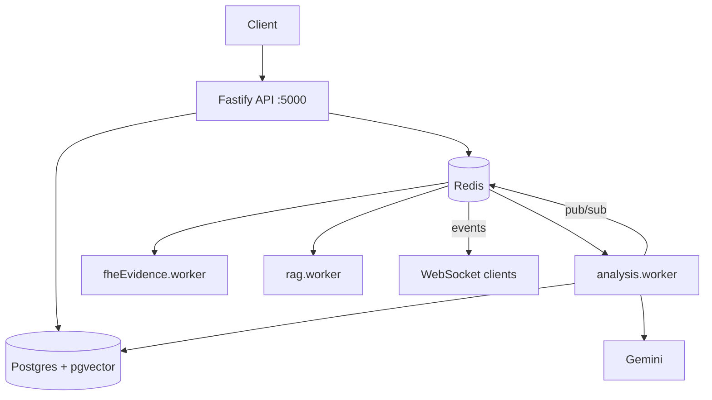

# Architecture

## Process topology

One process, four roles. `src/index.js` boots the Fastify app, then dynamically imports three worker modules — importing them *is* starting them.



> [!note] Why in-process
> `src/index.js` says it plainly: free-tier single-service hosting. The workers are ordinary BullMQ workers and would move to their own dyno with no code change beyond the import.

## Boot sequence

1. `dotenv/config`
2. `validateEnv()` — fails fast on missing `DATABASE_URL`, `JWT_SECRET`, `GEMINI_API_KEY`; also `REDIS_URL` when `NODE_ENV=production`, because falling back to `localhost:6379` on a container makes every enqueue 503 while the app looks healthy.
3. `buildApp()` — dynamic import, so env validation runs before any module reads `process.env` at load time.
4. Listen, then start the three workers.

## Shutdown

`SIGTERM`/`SIGINT` → stop taking work, close all three workers, close Fastify, `pool.end()`. A 15s unref'd timer force-exits if that hangs. This exists because Railway deploys send SIGTERM mid-job.

## Plugin order

Fastify only applies a plugin's hooks to routes registered *after* it, so order in `src/app.js` is load-bearing:

```
cors → helmet → compress → rateLimit(100/min/IP) → multipart(300MB, 10 files)
→ cookie → jwt → db → websocket(64KB frames) → authPlugin → routes → swagger
```

- **multipart 300 MB** is a sanity ceiling, not a storage cap — uploads are reduced to ≤4 MB on the fly by [[Analysis Pipeline|streamReduce]].
- **64 KB WS frames** because chat messages are tiny and a giant frame balloons memory before `JSON.parse`.

## Module layout

```
src/
  app.js index.js
  config/     env, redis
  db/         Client, schema           → [[Data Model]]
  plugins/    db, auth                 → [[Auth and RBAC]]
  lib/        redaction, redactionCrypto, fieldCrypto, llm, embeddings, rateLimiter
  modules/
    auth/ org/                         → [[Auth and RBAC]]
    incidents/  ingest, streamReduce, redactionStore
    analysis/   the RCA pipeline       → [[Analysis Pipeline]]
    incidentChat/ hybridContext, chatService
    rag/ reports/ runbooks/ graph/ realtime/ notifications/
    encryptedEvidence/                 → [[FHE Evidence]]
  rag/        chunk, rerank, store, pipeline → [[RAG Knowledge Base]]
  queues/ workers/ events/
native/       Rust TFHE addon          → [[FHE Evidence]]
```

`modules/*` is feature-vertical (routes + controller + service + repository). `lib/` and `rag/` are horizontal primitives shared across features — `embeddings.js` is the single embedding call site for both incident memory and the knowledge base.

## Realtime

`events/publisher.js` publishes to `incident:<id>` on a Redis connection dedicated to pub/sub (never shared with the queue connection). `realtime.routes.js` bridges subscribers to WebSocket clients. Publishing is wrapped in try/catch — an event failure must never kill a worker mid-job.
