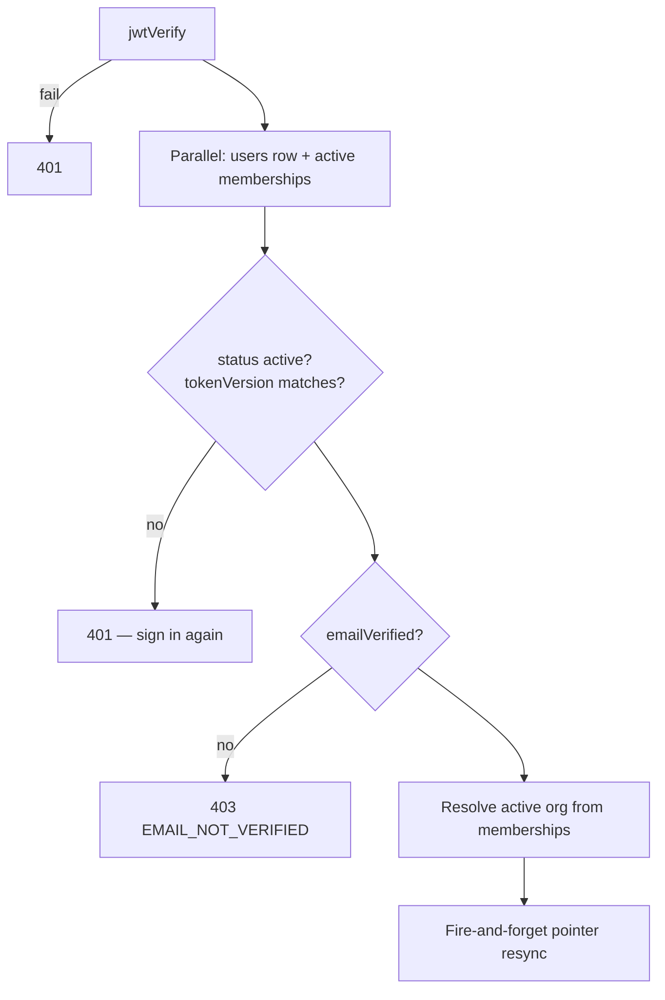

# Auth and RBAC

## Session model

Short access JWT (15m) + long refresh token (30 days), refresh in an httpOnly cookie.

> [!important] Only SHA-256 hashes are persisted
> `refresh_tokens`, `email_verification_tokens`, `invitations`, and `password_reset_tokens` all store `sha256(raw)`. A DB leak yields no usable sessions or redeemable links.

### Refresh rotation and theft detection

`token.service.js::rotateRefreshToken`. Presenting a token that was **already rotated or revoked** means someone is replaying a stolen one → **every** session for that user is revoked. The `replaced_by_id` column is the rotation chain that makes this detectable.

## The authenticate decorator — `plugins/auth.js`

JWT verification alone isn't enough; the plugin re-checks the DB on every request so suspension, role changes, and `tokenVersion` bumps take effect **immediately** rather than when the JWT expires.

Both lookups fire in one round-trip via `Promise.all` — the memberships read keys on the verified JWT's `user.id`, not on the not-yet-loaded user row, so it has no dependency to wait on.

### tokenVersion

Bumped on password change, role change, or suspension. Invalidates every outstanding access JWT and refresh token for that user at once.

### The membership/pointer split

> [!note] `org_memberships` is authoritative
> `users.organizationId` and `users.role` are just a **cache** of the active membership, so JWT claims and login responses don't need a join. When they drift (org switch elsewhere, role change, removal), the plugin corrects them **without awaiting** the write — it's a cache correction, not something the response needs. Errors are logged, never surfaced.

One row per `(user, org)`, unique-constrained. The same account can own its own workspace and be a viewer in another. "Removing" a member **suspends the membership, never the account**.

## Permissions — `modules/auth/rbac.js`

AWS-IAM-style `resource:action` strings grouped into roles. Routes declare what they need via `app.requirePermission(...)`.

| Role | Gains |
|---|---|
| **viewer** | `incidents:read`, `reports:read`, `graph:read`, `runbooks:read`, `knowledge:read`, `realtime:subscribe`, `org:members:read` |
| **member** | viewer + `incidents:create`, `evidence:upload`, `analysis:run`, `graph:write`, `knowledge:write`, `incident:chat` |
| **admin** | member + `incidents:delete`, `org:members:invite`, `org:members:manage` |
| **owner** | admin + `org:manage` |

`incident:chat` is separated out because it invokes the LLM and writes the transcript — a cost-and-data action, not a read.

## OAuth — `oauth.routes.js`

Google and GitHub, each registering **only when its credentials are present**, so the app boots fine with no OAuth configured.

- PKCE `S256` on Google.
- Google profiles are rejected unless `email_verified` is true — only addresses Google itself has verified are trusted.
- Callback → `findOrCreateOAuthUser` → `issueSession`.
- `oauth_accounts` is unique on `(provider, provider_account_id)`.
- OAuth-only accounts have a **null** `password_hash`.

## Other hardening

- Login lockout: `failed_login_attempts` + `locked_until` on the users row.
- Global rate limit 100 req/min/IP (`@fastify/rate-limit`), plus `lib/rateLimiter.js`.
- `helmet` registered before all route plugins.
- CORS origins from `FRONTEND_URL` (comma-separated), credentials on.
- Email verification required to pass `authenticate` at all.
