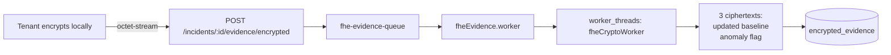

# FHE Evidence

Homomorphic encryption over evidence, via a Rust `tfhe-rs` napi addon in `native/`. Real working code, **narrow scope**, not on the live analysis path.

> [!warning] Read this first
> FHE here computes a **numeric anomaly-threshold comparison** on encrypted values. It cannot analyze log *text*. Confidential LLM analysis is solved by the provider seam in [[Privacy Architecture]], not by this.

## Trust model

| Party | Holds |
|---|---|
| Tenant | The secret client key — **never** sent to Forge |
| Forge | The public server key only (`tenant_fhe_keys.server_key_bytes`) |

The server key permits **computation** on ciphertexts, never decryption. Forge processes evidence it cannot read, and returns ciphertexts only the tenant can open.

## Flow

Route (`encryptedEvidence.routes.js`): registers an `application/octet-stream` content-type parser, ≤10 MB body, UUID-validates the incident id, verifies org ownership, requires `evidence:upload`.

Worker (`fheEvidence.worker.js`):
- Runs the crypto in a **separate `worker_threads` thread** with a 30s timeout — TFHE ops are CPU-bound and would block the event loop.
- `ANOMALY_THRESHOLD = 10_000`, hardcoded with a `TODO` for per-tenant config.
- **Server key cache**: keys are ~60 MB and rarely change, but re-reading one from Postgres per job dwarfed the actual crypto time. FIFO, max 3 tenants, 10-minute TTL — the TTL bounds how long a rotated or deleted key keeps being used by a running worker.

## Storage

`encrypted_evidence` holds `input_ciphertext`, `updated_baseline_ciphertext`, `anomaly_flag_ciphertext` as **bytea**, plus an indexed `input_hash`. See [[Data Model]] for why bytea beat base64 text.

## Threshold decryption — designed, deliberately not built

`native/THRESHOLD_DESIGN.md`, marked **REFERENCE ONLY, NOT AUDITED**.

> [!danger] What the design says about itself
> Getting threshold LWE decryption wrong — insufficient noise flooding, weak share distribution, no malicious-party detection — **leaks the secret key**. This is a common failure mode in homemade threshold crypto, which is why the established literature exists.

**Not possible today:** N parties jointly performing TFHE *bootstrapping* (blind rotation against a shared bootstrapping key) with nobody able to reconstruct the full secret. That is open research, not an engineering gap. Anything claiming to ship it as a library feature should be treated with suspicion.

**Real and implementable:** threshold *decryption* of an LWE ciphertext (Boneh et al. 2018; Asharov et al. 2012) — `t`-of-`N` Shamir shares from a distributed keygen ceremony, Forge computes with the public server key only, each node contributes a noise-flooded partial decryption, Lagrange interpolation recovers the plaintext.

**Why it stays out of `lib.rs`:**
1. Noise-flooding magnitude must be calibrated to the chosen tfhe-rs LWE parameter set. The wrong constant is a **silent, invisible vulnerability** — that needs cryptographic sign-off, not a picked default.
2. The keygen ceremony needs authenticated transport with dishonest-majority protection, or a trusted setup — a protocol decision about who the threat model actually protects against.

**Recommended path:** ship the single-key core (already gives "Forge cannot decrypt tenant telemetry" for a single tenant-held key); engage a cryptography firm before multi-party touches production data. "It compiled and the tests passed" is not evidence of security here.

## Status

Prototype. `src/db/schema.js` flags it inline: *"FHE encrypted evidence prototype — see vault note before treating as live."* Do not present it as a shipped privacy guarantee; [[Privacy Architecture]] layers 1–3 are what is actually live.
