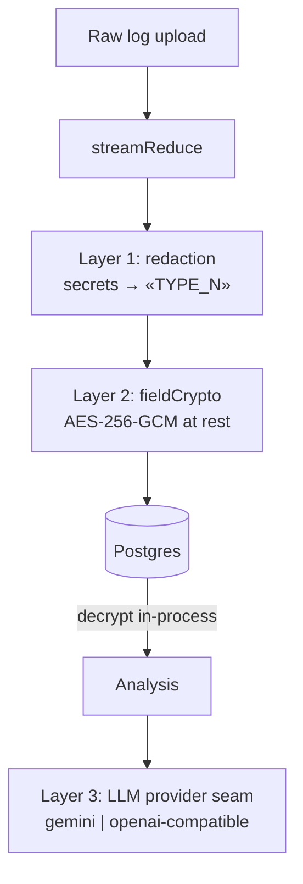

# Privacy Architecture

Three layers, shipped in order of how much they actually buy.



## Layer 1 — Reversible redaction at ingest

`src/lib/redaction.js`. Applied **before** anything reaches Postgres or the LLM.

Secrets are replaced with **stable placeholders**: the same value always maps to the same `«TYPE_N»` token within a document set. The model can still reason structurally — "«IP_1» called «IP_2»", "the same «AWS_KEY_1» appears in both files" — without ever seeing a raw value.

> [!tip] Why guillemets
> `« »` essentially never appear in real logs, so a placeholder cannot collide with genuine log text during re-hydration.

Detectors run **most-specific → most-general**, each capturing a named `val` group so only that span is replaced and context (`password=`) survives:

`PRIVATE_KEY` → `JWT` → `AWS_KEY` → `GITHUB_TOKEN` → `BEARER` → `PASSWORD` (connection-string) → `SECRET` (generic key=value) → `EMAIL` → `SSN` → `CARD` → `IP`

`CARD` is Luhn-validated so long numeric IDs aren't redacted as credit cards.

The reverse map goes to `evidence_redactions`, encrypted per value (`redactionCrypto.js`). On re-upload, `loadRedactionSeed` decrypts the existing map and seeds the redactor so token numbering continues rather than restarting.

## Layer 2 — Encryption at rest

`src/lib/fieldCrypto.js`. AES-256-GCM over `evidence.extracted_data`. Redaction removes the secrets; this encrypts the *remaining* operational log content so a raw DB dump reveals nothing readable.

Values carry a `gcm1:` marker. `decryptField` passes through anything without it, which makes two things safe: existing plaintext rows keep working, and disabling the feature is a no-op on reads.

Single read path: `evidence.repository.js::getEvidenceForIncident` decrypts transparently, so analysis, embeddings, and chat context all get usable text without knowing encryption exists.

## Key derivation

One env secret, two cryptographically independent keys, per tenant:

| Purpose | scrypt context | Module |
|---|---|---|
| Redaction reverse-map | `forge-redaction:<tenantId>` | `redactionCrypto.js` |
| Evidence at rest | `forge-evidence-at-rest:<tenantId>` | `fieldCrypto.js` |

```js
crypto.scryptSync(process.env.REDACTION_KEY, `forge-redaction:${tenantId}`, 32)
```

> [!success] What this buys
> A database compromise **alone** yields nothing. `REDACTION_KEY` lives only in the environment. Per-tenant derivation means one tenant's map can never decrypt another's even under the same master secret.

> [!warning] What it does not buy
> Single master secret — its compromise is total. No rotation path exists: `loadRedactionSeed` catches decrypt failures and skips the row, so a rotated key silently orphans old mappings rather than erroring.

## Env gating

Both layers key off `REDACTION_KEY` being present (`redactionEnabled()`, `fieldEncryptionEnabled()`). Unset → both off, pipeline behaves exactly as it did before the features existed. Setting the key is the whole rollout.

## Layer 3 — The LLM provider seam

`src/lib/llm.js`. Two providers behind one interface:

```
generateJson(prompt)   -> Promise<string>
generateStream(prompt) -> AsyncIterable<string>
```

```bash
LLM_PROVIDER=gemini              # default, identical to prior behavior
LLM_PROVIDER=openai-compatible LLM_BASE_URL=... LLM_API_KEY=... LLM_MODEL=...
```

This is the point: **confidential inference becomes a config flip, not a rewrite.** Point `LLM_BASE_URL` at an OpenAI-compatible endpoint running in a GPU TEE — self-hosted vLLM in a confidential VM, or a confidential endpoint — and log text is analyzed inside a sealed enclave with no caller changes.

Gemini path keeps its transient-error retry: 4 attempts, linear 5s×attempt backoff, matching on `503` / `high demand` / `fetch failed` / `ECONNRESET` / `ETIMEDOUT` / `aborted` / `network`.

> [!failure] The seam has one hole
> `modules/analysis/runbookScorer.js` instantiates `new GoogleGenerativeAI(process.env.GEMINI_API_KEY)` at module load and calls `gemini-2.5-flash` directly. Flipping `LLM_PROVIDER` moves the RCA and the chat but **not** the runbook scorer — meaning root-cause text still leaves for Google's API. Routing it through `generateJson` closes it.

## Layer 4 — see [[FHE Evidence]]

Homomorphic encryption over evidence. Real Rust/TFHE code, but confined to a numeric anomaly-threshold comparison — it cannot analyze log *text*, which is why the provider seam above is the actual answer for confidential LLM analysis.
