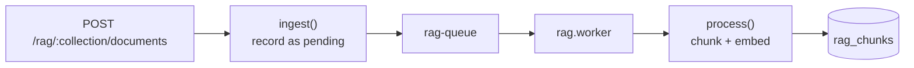

# RAG Knowledge Base

Generalized, collection-scoped document corpus in `src/rag/`. First consumer is the `runbooks` collection, used to ground RCA mitigation steps in the org's real procedures instead of the model's guesses. The `collection` namespace makes it reusable for any corpus.

## Pipeline shape

`RagPipeline` is scoped to a `(collection, tenantId)` pair. Ingestion is split so the HTTP request stays fast:

## Document lifecycle — SHA-256 macro-detection

`store.js::upsertDocument` decides one of three actions. Identity is the **source path** (`source_uri`) within a tenant+collection; anonymous docs fall back to content-hash identity.

| Action | Condition | Caller must |
|---|---|---|
| `unchanged` | Same identity, same content hash | **Abort** — no chunking, no embedding, no LLM calls |
| `created` | New document | Enqueue processing |
| `updated` | Same path, different content | Enqueue re-processing (purges old chunks, bumps `version`) |

> [!tip] Why path identity
> This is stale-knowledge invalidation. Re-uploading `runbooks/db-failover.md` updates that row in place instead of leaving a ghost duplicate that retrieval could still surface. Migration `0008` adds the partial unique index — partial so anonymous docs are still allowed.

## Chunking — `chunk.js`

Pure and dependency-free, therefore fully unit-testable. Markdown-aware.

| Default | Value | Why |
|---|---|---|
| `maxChars` | 1200 | ~300 tokens — small enough to retrieve precisely |
| `overlap` | 200 | Carries the previous chunk's tail for continuity |
| `minChars` | 60 | Trailing scraps get merged, not emitted |

Sections are split on headings and each chunk is prefixed with its **heading trail** breadcrumb (`Runbooks > Database > Failover`), so a retrieved chunk carries "where in the doc it came from" into the prompt.

`estimateTokens` uses ~4 chars/token — a budgeting heuristic, not exact.

## Embeddings — `lib/embeddings.js`

`gemini-embedding-001` over **REST**, not the SDK, so `outputDimensionality` can be pinned.

- **768 dims** — a Matryoshka truncation of the native 3072. Small enough for a lean pgvector HNSW index; cosine similarity is scale-invariant so truncated vectors need no renormalization.
- 8000 char input cap, 20s timeout, batches ≤100.
- 3 retries, then **returns `null`** rather than throwing — callers treat a missing embedding as a soft failure.

Single embedding primitive for the whole app: both incident memory and this knowledge base call it, guaranteeing one shared vector space per use.

## Retrieval — hybrid, then reranked

Vector search alone over-weights fuzzy semantic proximity and returns near-duplicates. `rerank.js` fixes both, model-free and pure:

1. **Hybrid score** — blend cosine similarity with lexical overlap, so a chunk literally containing the query's component names, error strings, or CLI flags is rewarded, not just a vibe match.
2. **MMR (Maximal Marginal Relevance)** — greedily pick results that are relevant *and* novel against what's already selected, so the context isn't three paraphrases of one paragraph. Diversity proxy is token-set similarity, avoiding the need for chunk embeddings at rerank time.

Also exports `reciprocalRankFusion` for merging ranked lists, and a `tokenize` with a stopword set that `hybridContext.js` reuses.

## Hybrid incident context — `modules/incidentChat/hybridContext.js`

The chat workspace pulls from **both** retrieval modes across every store:

| Postgres exact | pgvector semantic |
|---|---|
| Causal-graph component lookup (equality) | Runbook chunks by cosine |
| Keyword/ILIKE ranking of runbook chunks | Similar past incidents by cosine |
| Keyword filtering of *this* incident's telemetry | |

`keywordExcerpt` pulls the telemetry lines literally mentioning the question's terms, falling back to the timeline head if nothing matches, bounded to 2500 chars. Everything tenant-scoped and grounded to the specific incident.

## Storage

All vector operations go through raw SQL — the cosine operator `<=>` isn't in the drizzle query builder. See `rag_documents` / `rag_chunks` in [[Data Model]]; chunks cascade-delete with their document.
